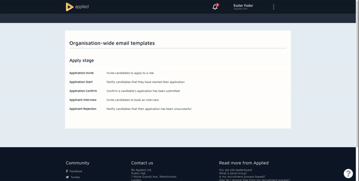
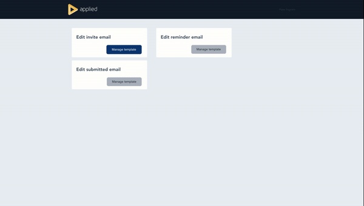

# Welcome to the Applied Technical & Pairing Task!

This repo is a super scaled down version of our production app and uses 🎨 Vue frontend,  🧰 Node.js with Express and 📊 Sequelize for database abstractions and migrations. We've also included a small sqlite database to keep things simple.

## Quick start

 **1. Clone this repository**

 **Please do not to fork this repository**. We'll be going through your solution during your interview so no need to push your changes or send it to us.

 **2. Install the main app dependencies & set up the database**

     yarn
     sequelize init
     npx seqelize-cli db:migrate

 **3. Start the backend 🧰**

    nodemon app.js
*(You may need to install `nodemon` globally first)*

 **4. Start the frontend 🎨**

    cd apps/dashboardApp
    yarn && yarn run serve

> **Tech test quirks and gotchas** 
>
> This was thrown together stupidly quickly so there are some little gotchas (feel free to add more to
> this list if you find them):
> 
> -   the sqlite database is fine but you can't have it open in a db browser while using it (which makes sense as it's a file) - theres
> probs a fix but I couldn't find it quickly (as an aside if you do want
> to peek inside your sqlite db I recommend 
> [sqlitebrowser](https://sqlitebrowser.org/))
>     
> -   The email template editing thing is a bit jank, it loads data from the component into the store badly (not an issue in prod where we use
> modals for editing) but it means you need to access that page from the
> root. Refreshing or loading it directly messes it up.

## The Brief

We send emails through the app at different stages of an applicants journey. We also allow organisations to customise those emails through their organisation settings. This is the part of the app you'll be working on as this repo includes a *very stripped down* version of our email template management functionality

*Video taken from the main Applied app*

In this build a user can update the **invite email template** but we've forgotten to add functionality which allows organisations to add a custom subject line. We would like you to add that functionality back in.

## Acceptance Criteria 

As a user, I want to be able to add a custom subject line to all email templates. 

*We should also include a test to check this is working as expected*

## Next steps

No need to commit your code as during your interview you will share your screen and be asked to talk through your process and solution. 

We will then complete a short pair programming exercise on the same repository so it's a good idea to have it running before the interview starts.

**Good luck!**

Applied Team 😊